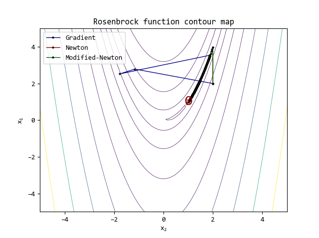
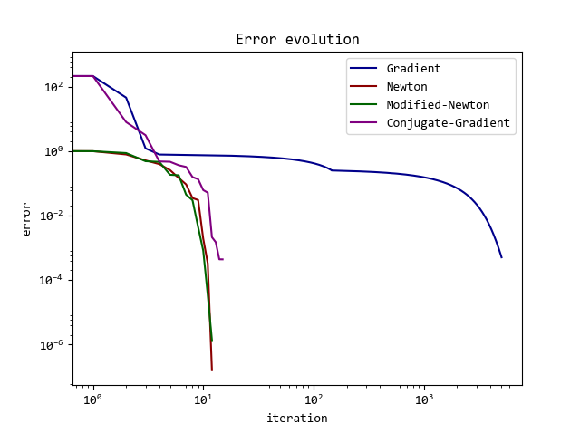
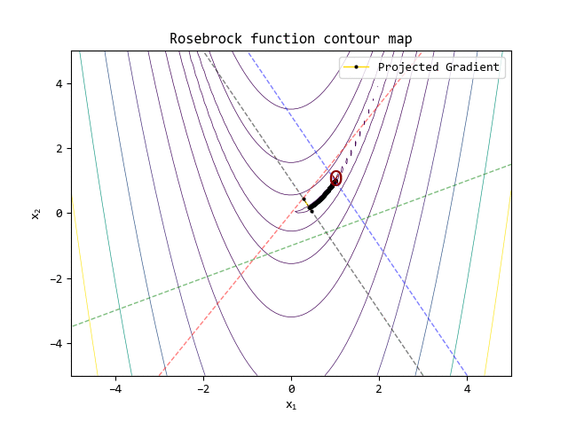
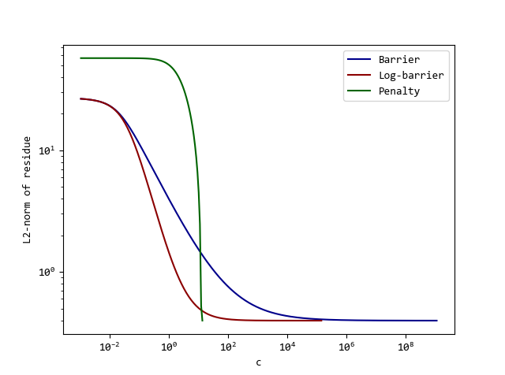
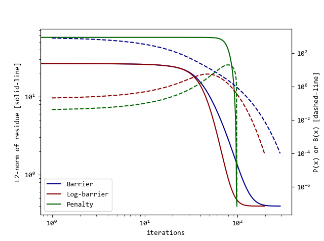

# optinpy

## Contents

- [Install and run](#install-and-run)
- [Command-line interface](#command-line-interface)
- [Find your task](#find-your-task)
- [Linear programming: graphs, flow, shortest paths, trees, and simplex](#linear-programming)
- [Nonlinear optimization: line search and unconstrained methods](#non-linear-optimization)
- [Linear constraints and projected gradient](#constrained-optimization-constrained)
- [Nonlinear constraints: penalty and barrier methods](#non-linearly-constrained-optimization-constrained)
- [Numerical differentiation](#numerical-differentiation)
- [Current algorithms and API reference](#algorithms-and-module-structure)
- [JAX compilation and batching](#jax-compilation-and-batching)
- [Existing interfaces and migration](#existing-interfaces)
- [Tests and releases](#tests-and-releases)
- [Original acknowledgements](#original-acknowledgements)

## Install and run

Requires Python 3.11+. Run these commands from the cloned repository directory.

```bash
python -m venv .venv
source .venv/bin/activate  # Windows: .venv\Scripts\activate
python -m pip install -e '.[dev]'
python main.py
python -m pytest -q
```

Write objectives with `jax.numpy`. For demanding numerical tolerances, enable
64-bit arithmetic **in your application**, before creating arrays. Optinpy does
not change global JAX settings. JAX defaults to 32-bit arithmetic; select tolerances
appropriate to the problem's scale and dtype.

```python
import jax
jax.config.update('jax_enable_x64', True)
import jax.numpy as jnp
import optinpy

rosenbrock = lambda x: (1 - x[0])**2 + 100 * (x[1] - x[0]**2)**2
result = optinpy.minimize(rosenbrock, [-1.2, 1.0], method='lbfgs', tol=1e-6)
print(result['x'], result['f'], result['success'])
```

## Command-line interface

Run solvers and individual algorithms on your own computer:

```bash
optinpy methods
optinpy minimize rosenbrock --x0 '[-1.2, 1]' --method lbfgs --json
optinpy line-search quadratic --x '[0, 0]' --method strong-wolfe
optinpy differentiate quadratic --x '[0, 1]' --order 2
optinpy simplex problem.json --json
```

Installation adds the `optinpy` command; `python -m optinpy` works too.
See the [CLI guide](docs/cli.md) for local objective functions, the LP input
format, precision, JSON results and exit codes.

## Find your task

You can call each algorithm directly, including differentiation and line search
without running a complete optimizer. The examples use the existing modules.

| Task | Entry point | Example |
| --- | --- | --- |
| Unconstrained optimization | `optinpy.minimize(fun, x0, method=...)` | [Choose an algorithm](docs/usage.md#unconstrained-optimization) |
| Original parameter-based interface | `optinpy.nonlinear.unconstrained.fminunc(...)` | [Parameters and history](docs/usage.md#original-parameters-and-history) |
| Gradient or Hessian | `optinpy.finitediff.jacobian(...)`, `.hessian(...)` | [Autodiff and finite differences](docs/usage.md#derivatives) |
| One line search | `optinpy.linesearch.backtracking(...)`, `.strong_wolfe(...)`, etc. | [Choose a step](docs/usage.md#line-search) |
| Linear programming | `optinpy.simplex(...).solve()` | [Bounds and simplex](docs/usage.md#linear-programming) |
| Linear constraints | `optinpy.nonlinear.constrained.fmincon(...)` | [Projected gradient](docs/usage.md#linear-constraints) |
| Nonlinear constraints | `optinpy.nonlinear.constrained.fminnlcon(...)` | [Penalty and barriers](docs/usage.md#nonlinear-constraints) |
| Repeated or batched solves | `optinpy.compile_minimizer(...)` | [Compilation and batching](#jax-compilation-and-batching) |
| Shortest paths or spanning trees | `optinpy.sp`, `optinpy.mst` | [Graph algorithms](docs/usage.md#graphs-shortest-paths-and-spanning-trees) |
| Minimum-cost flow | `optinpy.mcfp.bigm(...)` | [Supply, demand, and flows](docs/usage.md#minimum-cost-flow) |

## **Linear Programming**

These chapters retain the original algorithm-by-algorithm explanations and
examples. Run the imports in [Install and run](#install-and-run) first.
The plots are from the original implementation; current timing and numerical
validation are linked in the [API reference](#algorithms-and-module-structure).

### Graphs (`.graph`)

The graph, node, and arc interfaces retain their original role. Node `0` is
reserved for artificial arcs; shortest-path and spanning-tree algorithms
exclude it. See [current graph examples](docs/usage.md#graphs-shortest-paths-and-spanning-trees).

  - Graph tableau conversion remains unimplemented.
  - Node objects (`.node`)
  - Arc objects (`.arc`)

### Minimum-cost flow problem (`.mcfp`)

The Big-M formulation adds expensive artificial arcs to balance the network.
Real supplies and demands must sum to zero. The current implementation uses
optinpy's own simplex and writes optimal flows to the arcs; it does not build
a network-simplex spanning-tree basis. Artificial flow remaining at the end
raises an error, indicating infeasibility or a Big-M cost that is too small.

   - Big-M (`.bigm`)

**Example**

```python
### BIG-M ###

n3 = optinpy.graph() # Create an graph object
bs = zip(range(1,6),[10,4,0,-6,-8]) # Set node net production (+) or consumption (-)
for b in bs:
    n3.add_node(*b) # Add node to graph  and assign them a net production (+) or consumption (-)
connections = [[1,2,1],[1,3,8],[1,4,1],[2,3,2],[3,4,1],[3,5,4],[4,5,12],[5,2,7]] # Define arcs [from,to,cost]
for c in connections:
    n3.add_connection(*c) # Add arcs (connections) to the graph
optinpy.mcfp.bigm(n3,20) # MCF problem via Big-M
```

### Shortest-path Algorithms (`.sp`)

Dijkstra requires finite nonnegative costs. Bellman–Ford (`fmb`) supports
negative edges and detects reachable negative cycles. Both return predecessor
and distance dictionaries, as illustrated below.

  - Dijkstra's (`.dijkstra`)
  - Ford-Bellman-Moore's (`.fmb`)

**Example**

```python
### Example 1 ###

n = optinpy.graph()  # Create an graph object
connections = [[1,2,2],[1,3,4],[1,4,5],[2,4,2],[3,4,1]]
for c in connections:
    n.add_connection(*c) # Define arcs [from,to,cost]
rot,ds = optinpy.sp.fmb(n,1,verbose=True) # Shortest-path via Ford-Belman-Moore
rot,ds = optinpy.sp.dijkstra(n,1,verbose=True) # Shortest-path via Dijkstra

### Example 2 ### https://www.youtube.com/watch?v=obWXjtg0L64

n = optinpy.graph()  # Create an graph object
connections = [[1,2,10],[1,6,8],[2,4,2],[3,2,1],[4,3,-2],[5,2,-4],\
                [5,4,-1],[6,5,1]] # Define arcs [from,to,cost]
for c in connections:
    n.add_connection(*c) # Add arcs (connections) to the graph
rot,ds = optinpy.sp.fmb(n,1,verbose=True) # Shortest-path via Ford-Belman-Moore

### Example 3 ### https://www.youtube.com/watch?v=gdmfOwyQlcI

n = optinpy.graph()  # Create an graph object
connections = [['A','B',4],['A','E',7],['A','C',3],['B','C',6],['B','D',5],['C','D',11],\
                ['C','E',8],['D','E',2],['D','F',2],['D','G',10],['E','G',5]] # Define arcs [from,to,cost]
for c in connections:
    n.add_connection(*c) # Add arcs (connections) to the graph
rot,ds  = optinpy.sp.dijkstra(n,'A',verbose=True) # Shortest-path via Dijkstra
```

### Minimum spanning-tree Algorithms (`.mst`)

The current methods treat input connections as undirected and raise an error
for a disconnected graph. They return the selected input arcs.

  - Prim's (`.prim`)
  - Kruskal's (`.kruskal`)
  - Borůvka's (`.boruvka`)

**Example**

```python
n = optinpy.graph()  # Create an graph object
connections = [['A','B',7],['A','D',5],['B','C',8],['B','D',9],['B','E',7],['C','E',5],\
           ['D','E',15],['D','F',6],['E','F',8],['E','G',9],['F','G',11]] # Define arcs [from,to,cost]
for c in connections:
    n.add_connection(*c) # Add arcs (connections) to the graph
n2 = optinpy.graph()
connections = [['A','B',13],['A','C',6],['B','C',7],['B','D',1],['C','E',8],['C','D',14],\
               ['C','H',20],['D','E',9],['D','F',3],['E','F',2],['E','J',18],['G','H',15],\
               ['G','I',5],['G','J',19],['G','K',10],['H','J',17],['I','K',11],['J','K',16],\
               ['J','L',4],['K','L',12]] # Define arcs [from,to,cost]
for c in connections:
    n2.add_connection(*c) # Add arcs (connections) to the graph
# Assessing n2
print("Prims's")
arcs1 = optinpy.mst.prim(n2,'A',verbose=True) # Minimum spanning-tree via Prim
print("Kruskal's")
arcs2 = optinpy.mst.kruskal(n2,verbose=True) # Minimum spanning-tree via Kruskal
print("Boruvka's")
arcs3 = optinpy.mst.boruvka(n2,verbose=True) # Minimum spanning-tree via Boruvka
```

### Simplex (`.simplex`)

The original warning about lower/upper-bound glitches is resolved by the
current two-phase implementation. See [simplex fixes and validation](docs/simplex.md).

- **Constructor:** `S = optinpy.simplex(A, b, c, lb=lb, ub=ub)` defines a linear
problem minimizing $c^T x$ subject to $Ax \le b$ and $lb \le x \le ub$.
For $m$ variables and $n$ inequalities, $A$ is $n\times m$, $b$ has $n$
entries, and $c$, $lb$, and $ub$ have $m$ entries. Bounds default to
nonnegativity. Infinite bounds and fixed variables are supported.

- **Primal step:** `S.primal()` chooses an entering variable with an improving
reduced cost, then chooses a leaving variable by the minimum-ratio test to
maintain primal feasibility. The default uses Dantzig pricing; Bland and
steepest-edge pricing are also available. A step can perform phase-I cleanup.

- **Dual step:** `S.dual()` chooses a leaving row with an infeasible right-hand
side, then an entering column that maintains dual feasibility. It requires
nonnegative reduced costs and performs one pivot.

- **Complete solve:** `S.solve()` runs the two primal phases, including finding
an initial feasible basis. It returns the solution, objective, status,
iteration count, and feasibility residuals. `S.pivot(i, j)` exposes the
individual Gauss–Jordan operation for a valid pivot position.

```python
S = optinpy.simplex([[1., 1.]], [4.], [-3., -2.], lb=[0., 0.], ub=[2., 3.])
solution = S.solve()
assert solution['success'], solution['status']
print(solution['x'], solution['f'])  # Approximately [2., 2.], -10.
```

## **Non-linear Optimization**

### Line-search (`.linesearch`)

The methods below can be called individually through `optinpy.linesearch`.
Current runnable examples are in the [task guide](docs/usage.md#line-search).

Unidimensional minimizers seek an improvement along a descent direction $d$:

$$\phi(\alpha) = f(x_0 + \alpha d).$$

Backtracking and second/third-order interpolation enforce Armijo's sufficient
decrease condition, with $0<c<1$:

$$f(x_0+\alpha d) \le f(x_0)+c\alpha\nabla f(x_0)^T d.$$

Unimodality and golden section successively probe and reduce a bounded
interval of step lengths. Their interval-reduction reasoning assumes a
unimodal objective along the search interval; they are not general global
minimizers of a multimodal line objective.

#### Backtracking (`.backtracking`)

Finds an α value that satisfies Armijo's condition with successive value decrement by a factor ρ.

#### Interpolation, 2nd-3rd order (`.interp23`)

Finds an α value that satisfies Armijo's condition by successively minimizing a 2nd- or 3rd-order f(α) polynomial interpolated from the latest f-α pairs.

#### Strong Wolfe (`.strong_wolfe`)

The JAX version also provides bracketing and zoom with sufficient decrease
and an absolute directional-derivative bound:

$$|\nabla f(x_0+\alpha d)^T d| \le c_2|\nabla f(x_0)^T d|,\qquad 0<c_1<c_2<1.$$

Here $c_1$ is the Armijo parameter. A failed search returns `success=False`
and a zero step. Strong Wolfe is the default for the modern `minimize` API;
the legacy parameter dictionary still defaults to backtracking.

#### Unimodality (`.unimodality`)

Successive α-domain subsectioning by uniformly random probing.

#### Golden-section (`.golden_section`)

Successive α-domain subsectioning following the golden-ratio.

### Unconstrained Optimization (`.unconstrained`)

#### Parameters (`.params`)

A dictionary object that holds the method/algorithm's set-up for the [*fminunc*](#fminunc-fminunc), [*fmincon*](#fmincon-fmincon), [*fminnlcon*](#fminnlcon-fminnlcon) functions as well as for linesearch and numerical differentiation algorithms.

**Standard parameters in the JAX version**

The original nested dictionary remains the configuration interface for
`fminunc`, `fmincon`, and `fminnlcon`. The full current defaults are:

```python
{'fminunc': {'method': 'bfgs',
             'params': {'gradient': {'max_iter': 1000},
                        'newton': {'max_iter': 1000},
                        'modified-newton': {'sigma': 0.0001, 'max_iter': 1000},
                        'conjugate-gradient': {'max_iter': 1000},
                        'fletcher-reeves': {'max_iter': 1000},
                        'quasi-newton': {'max_iter': 1000, 'hessian_update': 'bfgs'},
                        'bfgs': {'max_iter': 1000},
                        'dfp': {'max_iter': 1000},
                        'lbfgs': {'max_iter': 1000, 'memory_size': 10},
                        'adam': {'max_iter': 1000, 'learning_rate': 0.01},
                        'sgd': {'max_iter': 1000, 'learning_rate': 0.01}}},
 'fmincon': {'method': 'projected-gradient',
             'params': {'projected-gradient': {'max_iter': 1000}}},
 'fminnlcon': {'method': 'penalty',
               'params': {'penalty': {'max_iter': 20},
                          'barrier': {'max_iter': 20},
                          'log-barrier': {'max_iter': 20}}},
 'jacobian': {'algorithm': 'autodiff', 'epsilon': None},
 'hessian': {'algorithm': 'autodiff', 'epsilon': None, 'initial': None},
 'linesearch': {'method': 'backtracking',
                'params': {'strong-wolfe': {'alpha': 1.0,
                                            'c1': 0.0001,
                                            'c2': 0.9,
                                            'max_iter': 60},
                           'backtracking': {'alpha': 1.0,
                                            'rho': 0.6,
                                            'c': 0.0001,
                                            'max_iter': 50},
                           'interp23': {'alpha': 1.0,
                                        'rho': 0.5,
                                        'c': 0.0001,
                                        'alpha_min': 0.1,
                                        'max_iter': 50},
                           'golden-section': {'b': 1.0,
                                              'threshold': 1e-05,
                                              'max_iter': 100},
                           'unimodality': {'b': 1.0,
                                           'threshold': 1e-05,
                                           'max_iter': 200}}}}
```

`max_iter` bounds iteration counts. In modified Newton, `sigma` is the lower
bound on Hessian eigenvalues. Quasi-Newton's `hessian_update` selects BFGS or
DFP; `initial` accepts an initial inverse-Hessian approximation for those
methods. `epsilon` selects a finite-difference perturbation; `None` uses the
dtype- and stencil-dependent choice explained below. Autodiff is now the
default differentiation algorithm.

For line searches, `alpha` is the starting step, `rho` reduces the step, and
`c` controls Armijo decrease. `interp23` safeguards its proposal between
`alpha_min * alpha` and `rho * alpha`. Interval searches use `b` as the upper
step bound and `threshold` as the target interval width. `strong-wolfe` uses
`c1` for sufficient decrease and `c2` for curvature.

The modern `minimize` and `compile_minimizer` functions receive their settings
as arguments; they do not read this shared dictionary. The nonlinear
continuation solver currently uses a fixed modified-Newton inner method, as
explained in its chapter below.

#### fminunc (`.fminunc`)

[*fminunc*](#fminunc-fminunc) evokes the so far implemented unconstrained non-linear optimization algorithms given the parameters set.

**Historical illustration: Gradient vs. Newton's Method, Modified-Newton** *(somewhere in between weighted by σ parameter)*, **and Conjugate Gradient** starting @ (2,2)<sup>*</sup>



**Log-scale error evolution**



<sup>*</sup> Line-search method: 'interp23' with *alpha* = 1, *rho* = 0.5, *alpha_min* = 0.1, *c* = 0.1 (*Armijo sufficient decrease*); gradient and Hessian calculation from central algorithms and 10<sup>-6</sup> perturbation *epsilon*. *max_iter* = 10<sup>3</sup>

##### Gradient (`method='gradient'`)

The gradient algorithm uses the first-order approximation

$$f(x_0+\Delta x)\approx f(x_0)+\nabla f(x_0)^T\Delta x,$$

with descent direction $d=-\nabla f(x_0)$. A line-search substep chooses
$\alpha$ by evaluating $f(x_0+\alpha d)$, then updates $x=x_0+\alpha d$.

##### Newton (`method='newton'`)

Newton's method uses the second-order approximation

$$f(x_0+\Delta x)\approx f(x_0)+\nabla f(x_0)^T\Delta x+
\tfrac12\Delta x^T H(x_0)\Delta x,$$

where $H$ is the Hessian. The Newton direction satisfies

$$H(x_0)d=-\nabla f(x_0).$$

Equivalently, $d=-H(x_0)^{-1}\nabla f(x_0)$ when the inverse exists. The code
solves the linear system. A line search determines the step length; the
current implementation falls back to negative gradient if the computed
direction is nonfinite or fails the descent check.

##### Modified Newton (`method='modified-newton'`)

Modified Newton enforces positive Hessian eigenvalues to obtain a descent
system. The original explanation used Cholesky factorization of a positive
definite matrix to express the solve as two triangular systems:

$$\widetilde H=LL^T,\qquad Ly=-\nabla f(x_0),\qquad L^T d=y.$$

In the current implementation, $H$ is symmetrized, its eigenvalues are clipped
from below by `sigma`, and the modified matrix is passed to a JAX linear
solve. The Cholesky equations explain the positive-definite solve; the code
does not explicitly call Cholesky. Raising `sigma` limits steps along weak or
negative curvature directions.

##### Conjugate Gradient (`method='conjugate-gradient'`)

The original derivation constructs Hessian-orthogonal ($Q$-conjugate)
directions through Gram–Schmidt $Q$-orthogonalization. For a positive definite
quadratic Hessian $Q$ and linearly independent candidates $p_i$,

$$d_{k+1}=p_{k+1}-\sum_{i=0}^{k}
\frac{p_{k+1}^TQd_i}{d_i^TQd_i}d_i.$$

With exact line searches on a quadratic, successive gradients are orthogonal.
Taking a new negative gradient as the candidate leads to a recurrence of the
form $d_{k+1}=-g_{k+1}+\beta_k d_k$, where $g_k=\nabla f(x_k)$.
The Hessian-based coefficient from the original explanation is

$$\beta_k=\frac{g_{k+1}^TQd_k}{d_k^TQd_k}.$$

The original parameter-based `fminunc` interface retains this coefficient when
`params['fminunc']['method']='conjugate-gradient'`. In `minimize`, select
`method='hessian-conjugate-gradient'`. With autodiff, a JAX Hessian-vector
product computes $Qd_k$ without allocating a dense Hessian. A supplied Hessian
or the legacy finite-difference setting is also supported.

The additional modern `minimize(method='conjugate-gradient')` option uses
Polak–Ribiere+:

$$\beta_k=\max\left(0,\frac{g_{k+1}^T(g_{k+1}-g_k)}{g_k^Tg_k}\right).$$

The separate `fletcher-reeves` method uses
$\beta_k=(g_{k+1}^Tg_{k+1})/(g_k^Tg_k)$. The methods periodically restart and
fall back to negative gradient if the proposed direction loses descent.
Exact conjugacy is a quadratic/exact-line-search property, not a promise for
general nonlinear objectives.

##### Quasi-Newton (`method='quasi-newton'`)

This is the legacy method selector. Modern calls select `method='bfgs'` or
`method='dfp'` directly. Both retain the inverse-Hessian updates below, with
curvature and finite-value safeguards. L-BFGS stores a limited number of
step/gradient-change pairs instead of a dense inverse-Hessian matrix.
Quasi-Newton methods are in between gradient and Newton's method, with successive approximations of the Hessian and its inverse matrix.

For the following updates, let $B_k$ denote the inverse-Hessian approximation,
and define the step and gradient change as in the original explanation:

$$q_k=\nabla f(x_{k+1})-\nabla f(x_k),\qquad p_k=\alpha_k d_k.$$

###### Davidon-Fletcher-Powell ('quasi-newton':'hessian_update':'dfp')

Rank-2 correction of the inverse Hessian as of a sum of 2 rank-1 matrices.

$$B_{k+1}=B_k+\frac{p_kp_k^T}{p_k^Tq_k}
-\frac{B_kq_kq_k^TB_k}{q_k^TB_kq_k}.$$

###### Broyden–Fletcher–Goldfarb–Shanno ('quasi-newton':'hessian_update':'BFGS')

A rank-two inverse-Hessian correction. The current JAX implementation
uses the expanded formula below, avoiding a pair of dense matrix products.

$$B_{k+1}=B_k+\left(1+\frac{q_k^TB_kq_k}{q_k^Tp_k}\right)
\frac{p_kp_k^T}{p_k^Tq_k}
-\frac{p_kq_k^TB_k+B_kq_kp_k^T}{q_k^Tp_k}.$$

### Constrained Optimization (`.constrained`)

#### fmincon (`.fmincon`)

[*fmincon*](#fmincon-fmincon) extends [*fminunc*](#fminunc-fminunc) functionality for cases in which linear constraints are in play.

**Historical illustration: Projected-gradient algorithm lifting off from the axis center @ (0,0) to a feasible starting point by Simplex with -∇f(x<sub>0</sub>) cost**



Constraints:

$$\begin{aligned}
2x_1-x_2&\le-1 &&\text{(black)}\\
5x_1+3x_2&\le0 &&\text{(red)}\\
2x_1+x_2&\le3 &&\text{(blue)}\\
x_1-2x_2&\le2 &&\text{(green)}
\end{aligned}$$

<sup>*</sup> Line-search method: 'interp23' with *alpha* = 1, *rho* = 0.6, *alpha_min* = 0.1, *c* = 10<sup>-3</sup> (*Armijo sufficient decrease*); gradient and Hessian calculation from central algorithms and *eps*<sup>0.5</sup> perturbation *epsilon*, where *eps* stands for the smallest *float64* number suchs that 1.0 + *eps* != 0. *max_iter* = 10<sup>3</sup>

##### Projected-gradient (`method='projected-gradient'`)

Projected gradient minimizes $f$ subject to $Ax\le b$ and
$A_{eq}x=b_{eq}$. Its first-order descent direction is

$$d=-P\nabla f(x_k),$$

where $P$ projects onto the nullspace of the working set of active constraints.
If $A_k$ stacks the active inequality rows and equality rows and has independent
rows, the original projection formula is

$$P=I-A_k^T(A_kA_k^T)^{-1}A_k.$$

For $r$ working constraints and $m$ variables, $A_k$ has shape $r\times m$.
The current code obtains a nullspace basis $Z$ by SVD and applies
$d=-Z(Z^T\nabla f)$, including redundant constraints. The geometry is reused
while the working set remains unchanged. A line search chooses a step in
$f(x_k+\alpha d)$, capped to avoid crossing an inactive constraint.

When the projected-gradient norm is small, Lagrange multipliers are checked.
For independent rows their expression is

$$\lambda=-(A_kA_k^T)^{-1}A_k\nabla f(x_k).$$

The current implementation uses the SVD pseudoinverse for this calculation.
A working inequality with a negative multiplier is released and the process
continues. Feasibility, small projected gradient, and nonnegative inequality
multipliers give the first-order KKT test. For a convex objective this
characterizes an optimum; for a general nonlinear objective it is a
stationarity condition.

**Feasible-start change:** the historical implementation used an LP and,
for a time, SciPy's `linprog`. The current solver uses its own bounded Dykstra
projections onto the constraint halfspaces/hyperplanes. No external optimizer
is called. Exhausting the projection budget is reported as a failure to find
a feasible start, not proof of infeasibility.

**Original four-variable example:** minimize
$f(x)=\lVert x\rVert^2-2x_1-3x_4$ under

$$2x_1+x_2+x_3+4x_4=7,\qquad x_1+x_2+2x_3+x_4=6.$$

The original illustration chose the feasible point
$x_0=(0,17/3,0,1/3)$, where
$\nabla f(x_0)=(-2,34/3,0,-7/3)$. With only equalities, the working set and
nullspace projector stay fixed. The reported optimum is approximately
$(1.123,0.6507,1.829,0.5685)$ with objective $1.401$. The original interpolation
line search reached it in one optimization iteration from that feasible
point; that is a historical measurement. The current starting-point search,
derivatives, and line search can produce a different iteration count.

```python
objective = lambda x: jnp.sum(x*x) - 2*x[0] - 3*x[3]
result = optinpy.nonlinear.constrained.fmincon(
    objective, jnp.zeros(4),
    Aeq=[[2., 1., 1., 4.], [1., 1., 2., 1.]], beq=[7., 6.], threshold=1e-12)
assert result['success'], result['status']
print(result['x'], result['f'])
```

### Non-linearly Constrained Optimization (`.constrained`)

#### fminnlcon (`.fminnlcon`)

[*fminnlcon*](#fminnlcon-fminnlcon) repeatedly minimizes an objective that
includes a weighted function of the constraints. The increasing parameter
$c$, multiplied by `beta` between outer steps, strengthens a penalty or
weakens a barrier. The current API accepts scalar inequalities $g_i(x)\le0$.

This approach relies on successive unconstrained optimization. Barrier solves
must remain strictly feasible; penalty solves allow violations while pushing
toward feasibility. A factor `beta` too close to one can require many outer
steps, while increasing the weight too quickly can make the inner problem
poorly conditioned. Reusing the previous solution provides a starting point
for each new weight.

**Inner-method change:** the original implementation selected the inner
unconstrained method through [`.nonlinear.params`](#parameters-params).
The current `fminnlcon` compiles one modified-Newton inner solver and passes
the changing constraint weight as numerical data. The dictionary selects
`penalty`, `barrier`, or `log-barrier`; it does not change this inner method.
Convergence depends on both the original objective and the weighted
constraint function $P(x)$ or $B(x)$.

The original discussion recommends modified Newton when curvature becomes
ill-conditioned near a constraint boundary. Its eigenvalue floor helps
regularize the inner solve, but convergence still needs to be checked.
The current methods report `success`, a KKT error, and constraint violation.

##### Penalty (`method='penalty'`)

The penalty algorithm can start from a feasible or infeasible point. It solves
a sequence of unconstrained objectives

$$f(x)+cP(x),\qquad P(x)\ge0,\quad P(x)=0\text{ on the feasible set}.$$

For inequalities $g_i(x)\le0$, the current quadratic penalty is

$$P(x)=\tfrac12\sum_i\max(0,g_i(x))^2.$$

This replaces the unsquared penalty described in the original version. Larger
$c$ penalizes violations more strongly; under suitable assumptions and accurate
inner solves, violations approach zero along the penalty solution sequence.
The objective and constraint residuals still need to be checked at termination.

##### Barrier (`method='barrier'`)

Barrier algorithms must start strictly inside the feasible region. They solve

$$f(x)+\frac{1}{c}B(x),\qquad B(x)=-\sum_i\frac{1}{g_i(x)},\quad g_i(x)<0.$$

This reciprocal barrier is positive in the interior and diverges as a
constraint approaches zero from below. At a fixed strictly feasible point,
its weighted contribution decreases as $c$ increases. It is not zero
throughout the feasible region. The line search rejects infeasible trial
points; step selection matters near the boundary, where curvature can become
large.

##### Log-barrier (`method='log-barrier'`)

Following the general shape of barrier algorithms, the log-barrier algorithm must as well start from an initialy feasible point. The only difference is in the shape of *B*.

As default, *B*(x) = -∑(ln(-g<sub>i</sub>(x))) for i = 1, 2, 3, ... *p*, where g<sub>i</sub> is the i<sup>th</sup> constraint.

**Original nonlinear example**: f(x) = (x<sub>1</sub>-2)² + 2(x<sub>2</sub>-4)² + 3(x<sub>3</sub>-4)², under the constraint: ||x||² ≤ 1.

Optimal point @ x\* = (0.1547,0.5744,0.8038), f(x\*) = 57.5212

**Historical figure settings:** Barrier and Log-barrier methods beginning from the feasible point x<sub>0</sub> = (0.1,0.1,0.1) and, the Penalty method from the infeasible point (1.4,1.4,1.4), using the Modified-Newton method with minimum eigenvalue set at 1.0 and 'backtracking' linesearch method, with *alpha* = 1, *rho* = 0.6, *c* = 10<sup>-4</sup> (*Armijo sufficient decrease*). The initial value for the nonlineraly-constrained method *c* parameters: *c* = 10<sup>-3</sup> (constraint weight) and *beta* = 1.1 (weight increment, i.e. 10% per iteration) and threshold of 10<sup>-4</sup>.

The figures below are retained from the original README. Their residual
curves use different starting points for the barrier and penalty methods,
so they are not a comparison from identical initial conditions. Changing the
inner optimizer or its settings can also change the optimization path and
the residual curve. These historical figures are separate from the current
[JAX measurements](docs/jax-performance.md).

**L2-norm of residuals as function of the *c* parameter**



**L2-norm of residuals (left) and *P*(x) or *B*(x) (right) vs. iteration**



## **Numerical Differentiation**

### Finite Difference (`.finitediff`)

Numerical differentiation estimates derivatives at $x_0$ using small
coordinate perturbations. These finite-difference explanations remain useful
when choosing `algorithm='central'`, `'forward'`, or `'backward'`.
The current default is **autodiff** for both derivatives; the historical
`jacobian` name denotes the gradient of a scalar objective.

Let $u$ be machine epsilon for the input dtype. With `epsilon=None`, the current
finite-difference defaults depend on the derivative and stencil:

| Derivative | Central | Forward/backward |
| --- | --- | --- |
| Gradient | $u^{1/3}$ | $u^{1/2}$ |
| Hessian | $u^{1/4}$ | $u^{1/3}$ |

These choices balance truncation and rounding errors approximately; a problem
may require an explicit perturbation. They replace the original uniform
square-root-of-machine-epsilon default. Let $e_j$ denote the $j$th unit vector
and $h$ the selected perturbation in the formulas below.

##### Jacobian (`.jacobian`)

The original three first-derivative approximations, written for a scalar
objective and one coordinate at a time, are:

| Algorithm | Approximation to $\partial f/\partial x_j$ |
| --- | --- |
| Central | $[f(x+he_j)-f(x-he_j)]/(2h)$ |
| Forward | $[f(x+he_j)-f(x)]/h$ |
| Backward | $[f(x)-f(x-he_j)]/h$ |

##### Hessian (`.hessian`)

Second derivatives retain the original perturbations in one or two coordinates.

**Central off-diagonal ($j\ne k$):**

$$H_{jk}\approx\frac{f(x+he_j+he_k)-f(x+he_j-he_k)
-f(x-he_j+he_k)+f(x-he_j-he_k)}{4h^2}.$$

**Forward:**

$$H_{jk}\approx\frac{f(x+he_j+he_k)-f(x+he_j)-f(x+he_k)+f(x)}{h^2}.$$

On the diagonal: $[f(x+2he_j)-2f(x+he_j)+f(x)]/h^2$.

**Backward:**

$$H_{jk}\approx\frac{f(x-he_j-he_k)-f(x-he_j)-f(x-he_k)+f(x)}{h^2}.$$

On the diagonal: $[f(x-2he_j)-2f(x-he_j)+f(x)]/h^2$.

**Central diagonal:** the original higher-order five-point formula remains
the implementation used by `algorithm='central'`:

$$H_{jj}\approx\frac{-f(x+2he_j)+16f(x+he_j)-30f(x)
+16f(x-he_j)-f(x-2he_j)}{12h^2}.$$

Finite-difference probes are evaluated with `vmap`, and inputs are not mutated.
Only one triangle of mixed central derivatives is evaluated, then reflected;
the diagonal probes share the evaluation of $f(x)$.
See [standalone derivative examples](docs/usage.md#derivatives).

## Algorithms and module structure

| Module | Implementations owned by optinpy |
| --- | --- |
| `nonlinear/unconstrained.py` | Gradient descent, Newton, modified Newton, original Hessian-conjugate gradient, Polak–Ribiere+, Fletcher–Reeves, BFGS, DFP, L-BFGS, Adam, SGD |
| `nonlinear/constrained.py` | Working-set projected gradient, Dykstra feasibility projections, quadratic penalty, reciprocal barrier, log barrier |
| `linesearch/linesearch.py` | Armijo backtracking, safeguarded quadratic/cubic interpolation, strong Wolfe bracketing/zoom, golden section, randomized interval reduction |
| `finitediff/finitediff.py` | Automatic gradients/Hessians; central, forward, and backward finite differences |
| `graph/base.py` | Graph, node, and arc data structures |
| `sp/sp.py` | Dijkstra and Bellman–Ford |
| `mst/mst.py` | Prim, Kruskal, and Boruvka |
| `simplex/base.py` | Two-phase tableau simplex, primal and dual pivot steps, variable bounds |
| `mcfp/mcfp.py` | Big-M minimum-cost-flow formulation using optinpy's simplex |

The legacy simplex lower/upper-bound warning is addressed by the current
two-phase implementation. See [simplex fixes and usage](docs/simplex.md) and
the [independent solver comparison](docs/simplex-comparison.md) for validation,
runtime measurements, and precision limits.
The [startup and JIT timing report](docs/simplex-timing.md) separates first-use
wall time, compilation, and warm execution of the compiled simplex phases.

The [JAX library benchmark](docs/jax-library-comparison.md) also compares our
Newton linear-solve kernel with **Lineax**, BFGS/DFP/L-BFGS with **Optimistix**,
and Adam/SGD with **Optax**. It checks solution accuracy and separates compilation
from synchronized warm execution, retaining failures and timing spread.
These libraries are optional benchmark references; optinpy's algorithms remain
implemented in this package.

`minimize` accepts a real one-dimensional array and a scalar objective. Select
`method='bfgs'` (default), `'lbfgs'`, `'dfp'`, `'gradient'`, `'newton'`,
`'modified-newton'`, `'conjugate-gradient'`, `'hessian-conjugate-gradient'`,
`'fletcher-reeves'`, `'adam'`, or `'sgd'`.
Adam and SGD use `learning_rate` and full objective gradients. L-BFGS uses
`memory_size` stored pairs; BFGS/DFP store a dense inverse Hessian.

The default line search for `minimize` is `'strong-wolfe'`; other choices are `'backtracking'`,
`'interp23'`, `'golden-section'`, and `'unimodality'`. Pass settings through
`linesearch_options`. You may supply `jac` and `hess` callables; autodiff is the
default. `args=(...)` passes additional arguments to the objective and derivatives.

As in the original package, these choices are independent. Direction and
Hessian-update functions are also callable on their own through
`optinpy.nonlinear`; the complete optimizer uses these same implementations.
For example, assemble one quasi-Newton step with a chosen line search:

```python
from optinpy import nonlinear as methods

component_fun = lambda x: jnp.sum(jnp.array([1., 3.])*x*x)
component_x = jnp.array([1., 2.])
component_g = optinpy.finitediff.jacobian(component_fun, component_x)
component_inverse = jnp.eye(2)
component_d = methods.quasi_newton_direction(component_g, component_inverse)
component_step = optinpy.linesearch.strong_wolfe(
    component_fun, component_x, component_d,
    gradient=component_g, value=component_fun(component_x))
assert component_step['success']
component_new_g = optinpy.finitediff.jacobian(component_fun, component_step['x'])
component_inverse = methods.bfgs_update(
    component_inverse, component_step['x']-component_x, component_new_g-component_g)
```

Swap `bfgs_update` for `dfp_update`, choose another standalone line search, or
compute derivatives with a different method. Newton, conjugate-gradient,
L-BFGS, Adam and SGD primitives are available too. `minimize` also accepts
custom direction and line-search callables. See [component signatures and
composition examples](docs/usage.md#mix-and-match-components).

For scalar objectives, the default `jax.grad` uses reverse mode. Dense Hessians
use forward-over-reverse autodiff. You can choose modes explicitly through the
existing derivative callbacks, for example `jac=jax.jacfwd(rosenbrock)` or
`hess=jax.jacrev(jax.grad(rosenbrock))`; these choices should be benchmarked on
your objective. The original Hessian-conjugate method uses `jvp(grad(...))` to
compute its Hessian-vector product, and nonlinear KKT checks use `vjp` for
Jacobian-transpose products. See [measured autodiff modes](docs/autodiff-modes.md)
and the [warm-execution improvements](docs/warm-execution.md).

Results contain `x`, `f`, `gradient`, `gradient_norm`, `iterations`,
`ls_iterations`, `success`, and `status`. Convergence means the gradient's
Euclidean norm is at most `tol`; it does not prove a global minimum or exclude
saddle points. Status codes for `minimize` are:

| Code | Meaning |
| --- | --- |
| 0 | Converged |
| 1 | Iteration budget exhausted |
| 2 | Line search failed or floating-point stagnation |
| 3 | Nonfinite objective, gradient, or iterate |

## JAX compilation and batching

Create a compiled solver once for repeated problems. Pass changing objective
data to that callable so matching shapes and dtypes reuse compilation.

```python
objective = lambda x, target: jnp.sum((x - target)**2)
solve = optinpy.compile_minimizer(objective, method='bfgs')
result = solve(jnp.zeros(2), jnp.array([1., 2.]))
batch_solve = jax.jit(jax.vmap(solve, in_axes=(None, 0)))
solutions = batch_solve(jnp.zeros(2), jnp.array([[1., 2.], [-2., 1.]]))
print(solutions['x'])
```

An outer `jax.jit` around `minimize` also works. Repeated eager `minimize`
calls create internal loop functions and can recompile. Keep the compiled
callable alive; do not recreate it inside a loop. `donate_x0=True` is an
optional factory setting that allows JAX to reuse the starting array's buffer;
the caller must then stop using that array after the solve. It is off by default.

Close over method names and solver settings when using `jax.jit`; these are
static configuration. Objective arguments and starting arrays can be dynamic.
`history=True` records iterates using a Python driver and is not compatible
with whole-solve `jit`/`vmap`. Dynamic optimization loops do not support reverse-mode
differentiation through the solution. Automatic differentiation **of the objective**
is supported. PyTree parameters and minibatch training are not implemented.

The constrained, simplex, and graph APIs use Python control flow. They are
not whole-solve JIT/batching interfaces. CI verifies CPU behavior; GPU/TPU
performance and numerical behavior have not been validated.

The [JAX optimization audit](docs/jax-audit.md) covers every runtime module,
compilation reuse, batching, memory, precision, and remaining limits. Its
[measurements](docs/jax-performance.md) separate lowering/compilation from
execution and retain the complete timing samples.

## Existing interfaces

The original entry points remain available:

```python
optinpy.nonlinear.params['fminunc']['method'] = 'bfgs'
result = optinpy.nonlinear.unconstrained.fminunc(
    rosenbrock, [-1.2, 1.0], threshold=1e-12, vectorized=True)

constrained = optinpy.nonlinear.constrained.fmincon(
    lambda x: jnp.sum((x - 2)**2), [0., 0.],
    A=[[1., 1.]], b=[1.], threshold=1e-12)

lp = optinpy.simplex([[1., 1.], [1., 0.]], [4., 2.], [-3., -2.])
print(lp.solve())
```

In `fminunc`/`fmincon`, `threshold` retains the legacy squared-gradient-norm
meaning; `minimize(tol=...)` uses the norm itself. Legacy `vectorized=True`
means iteration history, not a batch of independent problems. Legacy parameter
dictionaries are shared mutable settings; prefer `minimize` for independent solves.
The legacy `fminunc` interface uses `params['linesearch']`, which defaults to
`'backtracking'`. Changing `params` affects the legacy interfaces; configure
`minimize` and `compile_minimizer` through their own arguments.

`fminnlcon(fun, x0, g, c, beta)` accepts scalar inequalities `g_i(x) <= 0`.
Barrier methods require strict initial feasibility. These local continuation
methods remain experimental; inspect `success`, `err`, and `constraint_violation`.
Linear phase-I failure (status 4) means the projection budget did not find a
feasible point, not a proof of infeasibility. Simplex has its own status codes,
documented in the class docstring.

Migration changes: numerical arrays are JAX arrays; derivatives default to
autodiff; BFGS replaces Newton as the default minimizer; modern conjugate-gradient
uses Polak–Ribiere+; finite differences never mutate inputs. Graph node `0` is
reserved for artificial arcs, which shortest-path and spanning-tree algorithms
exclude. Disconnected spanning-tree requests and reachable negative cycles
raise errors. Big-M writes optimal flows to arcs, without constructing a network
simplex spanning-tree basis.

## Tests and releases

GitHub Actions tests Python 3.11–3.13 on Linux, plus Python 3.12 on macOS and
Windows. It also checks the declared minimum JAX/NumPy versions, float32/float64,
known solutions, failure reporting, JIT, and batching. A dependent build job
builds the source distribution and a wheel from it, validates metadata, installs
the wheel outside the checkout, and uploads distribution artifacts.

[Publishing](.github/workflows/publish.yml) is manually triggered on a version
tag matching `pyproject.toml`. It reruns CI and publishes its tested artifacts to
TestPyPI (default) or PyPI. Configure the corresponding GitHub environment and
[PyPI Trusted Publisher](https://docs.pypi.org/trusted-publishers/using-a-publisher/)
for this repository and `publish.yml` before using it. No API tokens are stored
in the repository. See [CONTRIBUTING.md](CONTRIBUTING.md).

GPL-3.0-only. Original author: Gabriel S. Gusmao.

## Original acknowledgements

**The University of Campinas, UNICAMP**

* IA897 - Introdução à Otimização Matemática - *Introduction to Optimization*
* IA881 - Otimização Linear - *Linear Programming*
* IA543 - Otimização Não Linear - *Nonlinear Optimization* (Prof. Takaaki)

Copyright © 2016 - Gabriel Sabença Gusmão

[](https://br.linkedin.com/pub/gabriel-saben%C3%A7a-gusm%C3%A3o/115/aa6/aa8)

[](https://www.researchgate.net/profile/Gabriel_Gusmao?cp=shp)
